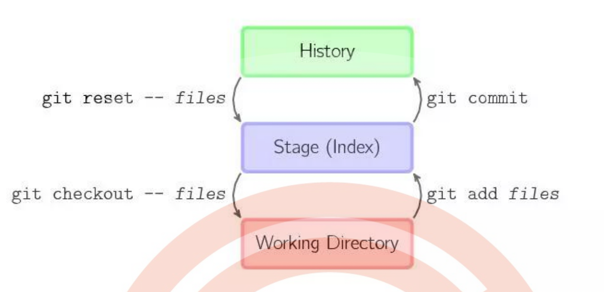

# git reset、git revert 和 git checkout 有什么区别

这个问题同样也需要先了解 git 仓库的三个组成部分：工作区（Working Directory）、 暂存区（Stage）和历史记录区（History）。

- 工作区：在 git 管理下的正常目录都算是工作区，我们平时的编辑工作 都是在工作区完成

- 暂存区：临时区域。里面存放将要提交文件的快照

- 历史记录区：git commit 后的记录区

三个区的转换关系以及转换所使用的命令：

## 共同点：

用来撤销代码仓库中的某些更改。

## 不同点：

### 从 commit 层面来说：

- git reset 可以将一个分支的末端指向之前的一个 commit。然后再下次 git 执行垃圾回收的时候，会把这个 commit 之后的 commit 都扔掉。git reset 还支持三种标记，用来标记 reset 指令影响的范围：

  - mixed：会影响到暂存区和历史记录区。也是默认选项
  - --soft：只影响历史记录区
  - --hard：影响工作区、暂存区和历史记录区

    > 注意：因为 git reset 是直接删除 commit 记录，从而会影响到其他开发人员的分 支，所以不要在公共分支（比如 develop）做这个操作。

- git checkout 可以将 HEAD 移到一个新的分支，并更新工作目录。 因为可能会覆盖本地的修改，所以执行这个指令之前，你需要 stash 或者 commit 暂存区和工作区的更改。
