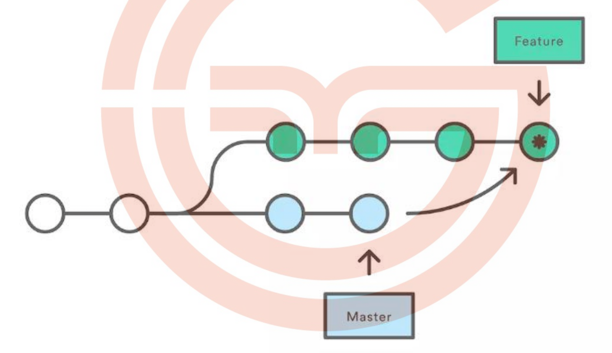
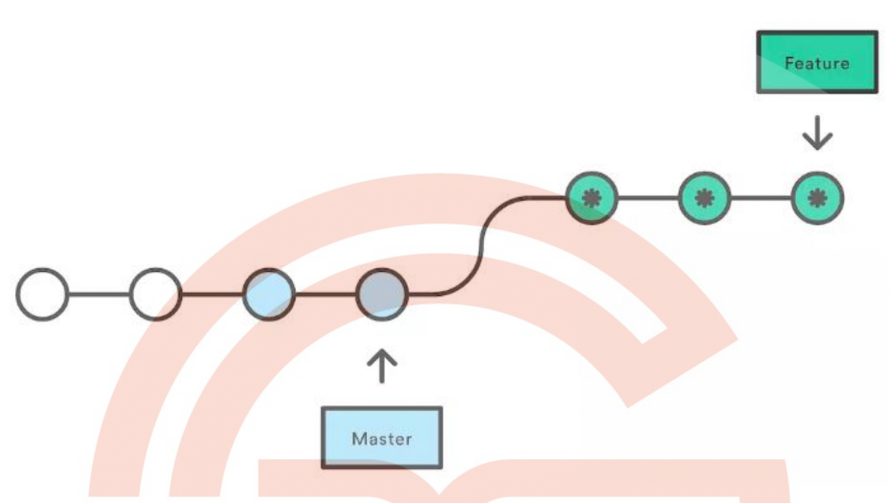

# rebase 与 merge 的区别?

相同点都是用于从一个分支获取并且合并到当前分支

## 场景

[feature/todo]分支要合并到 master 主分支,那么用 rebase 或 者 merge 有什么不同呢?

## marge

- 特点：自动创建一个新的 commit 如果合并的时候遇到冲突，仅需 要修改后重新 commit

- 优点：记录了真实的 commit 情况，包括每个分支的详情

- 缺点：因为每次 merge 会自动产生一个 merge commit，所以在使用一些 git 的 GUI tools，特别是 commit 比较频繁时，看到分支很杂乱。

## rebase

- 特点：会合并之前的 commit 历史

- 优点：得到更简洁的项目历史，去掉了 merge commit

- 缺点：如果合并出现代码问题不容易定位，因为 re-write 了 history

## 总结

因此,当需要保留详细的合并信息的时候建议使用 git merge，特别是需要将分支合并进入 master 分支时；当发现自己修改某个功能时，频繁进行了 git commit 提交时，发现其实 过多的提交信息没有必要时，可以尝试 git rebase
