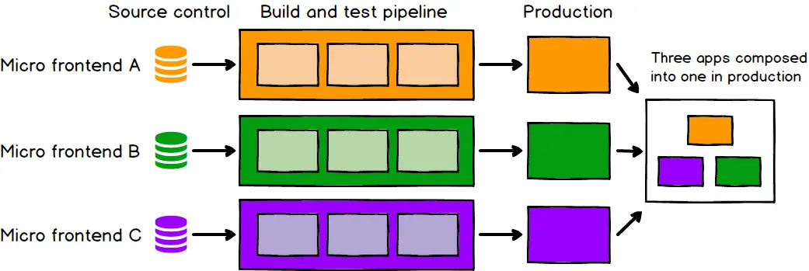
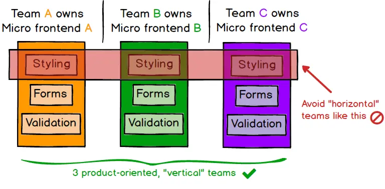

## 优点：

- 技术站无关（不限制应用的技术站）
- 独立开发独立部署
- 增量升级
- 独立运行
- 更小、更加内聚的、更加可维护的代码库
- 相互解耦、自治、灵活的结构
- 单独进行升级，不会影响的其他部分

### 增量升级

对于许多团队来说，增量升级是他们微前端旅程的开始。旧的、大的、前端巨石应用正在被过时的技术栈，或者是在交付压力下编写的代码所拖累，现在已经到了需要重写的时候了。为了避免全部重写，我们更喜欢一点一点地重写旧的应用程序，同时继续向我们的客户交付新特性，而不被巨石应用压得喘不过气来。

基于上述需求，这通常会导致一个微前端架构。一旦有一个团队有了只对旧的应用程序做少许修改就能将新的特性带入生产环境的经验，其他团队也会行动起来。已有的代码依然需要被维护，但是是否向旧的代码库增加新的功能，这变成了可选的。
我们获得了更多的自由，可以对产品的各个部分逐个做出决定，并对架构、依赖关系和用户体验进行增量升级。
如果产品需要修改或增加新的功能，我们只对需要升级的部分进行升级，而不是被迫停止整个应用并立即升级所有内容。如果我们想使用新技术，或新的模式，我们可以以一种比以前更加独立的方式来做。

### 简单并且解耦的代码库

每个独立的微应用的源代码比单体前端的源代码小得多。对于开发人员来说，这些较小的代码库往往更简单、更容易使用。我们避免了不相关的组件之间的耦合

### 独立部署

就像微型服务一样，各个微应用独立部署是关键。这减少了单次部署影响的范围，也降低了风险。无论你的前端代码托管到哪个地方，每一个微应用都应该独立进行持续交互。每个微应用的部署不应该依赖于其他的代码库

### 独立自主的团队

有了解耦的代码库和独立的发布周期，我们离拥有完全独立的团队还有很长的路要走，他们可以拥有产品的一部分，从构思到生产，甚至更远。团队拥有向客户交付产品所需要的一切，这使他们能够快速有效地行动。为了实现这一点，我们的团队需要围绕业务功能的垂直部分组成，而不是围绕技术能力。一种简单的方法是根据最终用户将看到的内容划分产品，所以我们可以根据页面来划分微应用。这比团队围绕技术或水平关注点(如样式、表单或验证)组成具有更高的内聚性。

### 简单

简而言之，微前端就是将大而可怕的东西分割成更小、更易于管理的部分，然后明确它们之间的依赖关系。我们的技术选择、我们的代码库、我们的团队和我们的发布过程都应该能够相互独立地操作和发展，而不需要过度的协调。